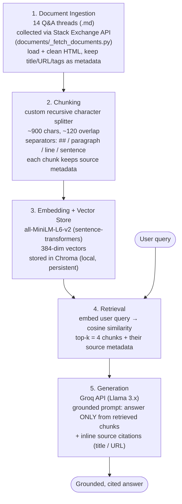

# Project 1 Planning: The Unofficial Guide

> Write this document before you write any pipeline code.
> Your spec and architecture diagram are what you'll use to direct AI tools (Claude, Copilot, etc.) to generate your implementation — the more specific they are, the more useful the generated code will be.
> Update the Retrieval Approach and Chunking Strategy sections if you change your approach during implementation.
> Update this file before starting any stretch features.

---

## Domain

<!-- What domain did you choose? Why is this knowledge valuable and hard to find through official channels? -->
Domain: Surviving grad school & academic life. This knowledge is valuable because it is student-to-student advice that helps people actually get through a graduate program: how to handle a difficult advisor, cope with imposter syndrome and discouragement, beat research procrastination, navigate academic-integrity situations, make writing/publishing decisions, and recover from career setbacks.
---

## Documents

<!-- List your specific sources: URLs, subreddit names, forum threads, or file descriptions.
     Aim for at least 10 sources that together cover different subtopics or perspectives within your domain. -->

All sources from Academia Stack Exchange (CC BY-SA), collected via the public Stack Exchange API — see [documents/_fetch_documents.py](documents/_fetch_documents.py). Each document is one Q&A thread (question + top-voted answers).

| # | Source | Description (subtopic / perspective) | URL or location |
|---|--------|--------------------------------------|-----------------|
| 1 | How should I deal with becoming discouraged as a graduate student? | Mental health — discouragement | https://academia.stackexchange.com/questions/2219 |
| 2 | How to effectively deal with Imposter Syndrome and feelings of inadequacy | Mental health — imposter syndrome | https://academia.stackexchange.com/questions/11765 |
| 3 | How to avoid procrastination during the research phase of my PhD? | Productivity / time management | https://academia.stackexchange.com/questions/5786 |
| 4 | First year Math PhD student; my problem-solving skill has atrophied | Coursework struggles / confidence | https://academia.stackexchange.com/questions/162431 |
| 5 | I don't want to kill any more mice, but my advisor insists | Advisor conflict / research ethics | https://academia.stackexchange.com/questions/67897 |
| 6 | Have I embarrassed my supervisors by solving a problem a PhD student couldn't? | Advisor / lab group dynamics | https://academia.stackexchange.com/questions/66820 |
| 7 | What to do when your student is convinced he'll be the next Einstein? | Supervision (advisor's perspective) | https://academia.stackexchange.com/questions/56220 |
| 8 | I was caught cheating on an exam — how can I minimize the damage? | Academic integrity / consequences | https://academia.stackexchange.com/questions/30539 |
| 9 | A student does well on exams but doesn't do the homework | Grading / exams (instructor view) | https://academia.stackexchange.com/questions/58721 |
| 10 | Professor creates assignment making students advocate for a bill | Coursework / ethics / legal | https://academia.stackexchange.com/questions/102950 |
| 11 | Choice of personal pronoun in single-author papers | Academic writing style | https://academia.stackexchange.com/questions/2945 |
| 12 | Software to draw illustrative figures in papers | Writing tools / workflow | https://academia.stackexchange.com/questions/1095 |
| 13 | University rank/stature — how much does it affect a post-PhD career? | Career path / prestige | https://academia.stackexchange.com/questions/90 |
| 14 | Is it possible to recover after a career setback? | Career recovery / resilience | https://academia.stackexchange.com/questions/10381 |

---

## Chunking Strategy

<!-- How will you split documents into chunks?
     State your chunk size (in tokens or characters), overlap size, and explain why those
     numbers fit the structure of your documents.
     A review-heavy corpus warrants different chunking than a long FAQ. -->

**Strategy:** Recursive character splitting (a small custom splitter — no extra dependency beyond the provided stack), with separators in priority order `["\n## ", "\n\n", "\n", ". ", " ", ""]`.

**Chunk size:** ~900 characters.

**Overlap:** ~120 characters (~13%).

**Reasoning:** Each document is one Q&A thread with a clear structure (`# Title`, `## Question`, `## Answer N`), and the actual advice is spread across paragraph-length prose rather than concentrated in single sentences. Recursive splitting respects that structure — it breaks first at answer headers, then paragraphs, and only cuts mid-sentence as a last resort — so a chunk holds one person's coherent point instead of blending the end of one answer with the start of another. This matters for source attribution: each chunk should trace cleanly back to one answer.

I rejected the alternatives: **fixed-size** chunking would slice mid-sentence and merge two separate answers into one chunk (bad grounding); **semantic** chunking adds embedding cost and tuning complexity at ingest time for marginal benefit, since my documents are already cleanly segmented by structure (semantic boundaries ≈ the paragraph boundaries recursive gives for free).

A ~900-char size is large enough to contain a full short answer or a substantive paragraph (so retrieved context is self-contained), and the ~120-char overlap preserves continuity at seams when a long answer spans multiple chunks. This is a forum/review-heavy corpus, so chunks are kept moderate — smaller than I'd use for a long-form FAQ or handbook, but large enough that an individual piece of advice isn't fragmented.

---

## Retrieval Approach

<!-- Which embedding model are you using (e.g., all-MiniLM-L6-v2 via sentence-transformers)?
     How many chunks will you retrieve per query (top-k)?
     If you were deploying this for real users and cost wasn't a constraint, what tradeoffs
     would you weigh in choosing a different embedding model — context length, multilingual
     support, accuracy on domain-specific text, latency? -->

**Embedding model:** `all-MiniLM-L6-v2` via `sentence-transformers`. It runs locally (no API key, no per-call cost), is fast on CPU, produces compact 384-dimensional vectors, and is a strong general-purpose model for short English passages — a good match for a 14-document corpus of English Q&A advice where I want quick iteration during development.

**Top-k:** 4. The advice for a given question is often spread across multiple answers, so a single chunk rarely holds the full picture; k=4 gathers enough context to ground a complete response while still fitting comfortably in the LLM's context window and keeping irrelevant chunks (which dilute the answer) low. I'll revisit this during evaluation — if retrieval misses, I'll try k=5–6.

**Production tradeoff reflection:** For real users I'd weigh:

- **Accuracy on domain-specific text** — MiniLM is a small, general model. A larger/newer hosted embedding model (e.g. Voyage, Cohere Embed, or OpenAI `text-embedding-3-large`) would better capture nuance in advice-style prose, improving retrieval on paraphrased or indirect queries ("my supervisor won't let me change methods" → mouse-ethics thread). This is the tradeoff I'd prioritize most, since RAG quality is bottlenecked by retrieval.
- **Context length** — MiniLM truncates input at 256 tokens, so my ~900-char chunks are near its limit and longer chunks would be silently clipped. A model with a larger input window (8k tokens) would let me embed whole answers or whole threads, reducing fragmentation.
- **Latency vs. local vs. API** — local MiniLM has zero network latency and keeps data private, which matters if real student content were sensitive. An API model adds round-trip latency and a vendor dependency but offloads compute and scales without managing GPUs. With cost off the table I'd still weigh privacy and reliability, not just accuracy.
- **Multilingual support** — my current corpus is English-only, so this isn't needed now. But if the guide expanded to international students posting in other languages, I'd switch to a multilingual model (e.g. `paraphrase-multilingual-MiniLM` or Cohere multilingual) so queries and documents in different languages still match.
- **Dimensionality / index cost** — larger models output bigger vectors (1536–3072 dims), raising storage and search latency in the vector store. Negligible at 14 docs, but a real tradeoff at scale.

---

## Evaluation Plan

<!-- List your 5 test questions with their expected correct answers.
     Questions should be specific enough that you can judge whether the system's response
     is right or wrong. "What are good dining halls?" is too vague.
     "What do students say about wait times at [dining hall name] during lunch?" is testable. -->

| # | Question | Expected answer (ground truth) | Source document |
|---|----------|--------------------------------|-----------------|
| 1 | What concrete tactics do people recommend for dealing with imposter syndrome in grad school? | Reinforce what you *do* know by reviewing material in your area, and engage non-academics (blogging, lectures, consulting) to remember how much you actually know. Recognizing that imposter syndrome is common also helps. | How to effectively deal with Imposter Syndrome… |
| 2 | In a single-author paper in math or the sciences, should I write "I" or "we"? | "I" is rarely used; the common choice is "we" (author + reader), e.g. "We examine the case when…". An exception is a memoir/personal piece where the author's identity is relevant. | Choice of personal pronoun in single-author papers |
| 3 | What free software do people recommend for drawing illustrative figures and diagrams in papers? | Inkscape (general SVG illustration), Dia (block diagrams / flowcharts, Visio-like), Graphviz (graph diagrams from text), and TikZ/PGF (LaTeX-based, flexible but steep learning curve). OmniGraffle is also mentioned but is paid/Mac-only. | Software to draw illustrative figures in papers |
| 4 | Does getting a PhD from a top-ranked department actually matter for an academic career? | It helps, but mainly by making you a *better researcher* (strong publishing culture) rather than by looking better on paper. What matters most is a strong, visible, independent research record; pedigree only acts as secondary signal, especially before an interview. | University rank/stature — how much does it affect a post-PhD career? |
| 5 | *(Hard / likely-failure case)* What's the best way to negotiate a higher PhD stipend with my department? | No good answer should be produced — **no document in the corpus covers stipend negotiation**. A correct system response is to say it cannot answer from the available sources, NOT to hallucinate advice. This tests grounding and refusal behavior. | (none — out-of-corpus) |

---

## Anticipated Challenges

<!-- What could go wrong? Name at least two specific risks with reasoning.
     Consider: noisy or inconsistent documents, missing source attribution, off-topic
     retrieval, chunks that split key information across boundaries. -->

1. **Conflicting / inconsistent advice across answers (noisy documents).** Each thread has multiple answers that often disagree (e.g. for figures: "use Inkscape" vs. "use TikZ" vs. "use OmniGraffle"). If retrieval pulls chunks from several answers, the LLM may blend them into a contradictory or falsely-confident response, or silently pick one opinion as "the" answer. *Mitigation:* prompt the model to present advice as differing viewpoints and attribute each to its source rather than asserting one truth.

2. **Hallucination on out-of-corpus questions.** My corpus doesn't cover everything (e.g. stipend negotiation — eval question #5). When no relevant chunk exists, semantic search still returns its *top-k closest* chunks even if they're only loosely related, and the LLM may fabricate an answer from them. *Mitigation:* a strict "answer only from the provided context; if it's not there, say you don't know" system prompt, and optionally a similarity-score threshold below which I return "no relevant sources found."

3. **Key information split across chunk boundaries.** An answer's setup and its conclusion can land in different ~900-char chunks; if only one is retrieved, the system gets half the point (e.g. the rank answer's "tl;dr: top dept helps, but by making you a better researcher" could be separated from its supporting argument). *Mitigation:* the ~120-char overlap reduces this, and retrieving k=4 increases the chance both halves surface; I'll watch for it during evaluation.

4. **Broken or missing source attribution.** Citations are required, so every chunk must carry metadata (document title + URL) through chunking → embedding → retrieval. If that metadata is dropped or mis-mapped during indexing, answers become ungrounded and untrustworthy even when the text is correct. *Mitigation:* attach source metadata to each chunk at ingest time and assert it's present before generation.

---

## Architecture

<!-- Draw a diagram of your pipeline showing the five stages:
     Document Ingestion → Chunking → Embedding + Vector Store → Retrieval → Generation
     Label each stage with the tool or library you're using.
     You can use ASCII art, a Mermaid diagram, or embed a sketch as an image.
     You'll use this diagram as context when prompting AI tools to implement each stage. -->

**Pipeline stages and tools:**

| Stage | Tool / library | Input → Output |
|---|---|---|
| 1. Ingestion | `urllib` + Stack Exchange API, custom cleaner | Raw HTML threads → cleaned `.md` with metadata |
| 2. Chunking | Custom recursive character splitter (no extra dep) | Documents → ~900-char overlapping chunks |
| 3. Embedding + store | `sentence-transformers` (all-MiniLM-L6-v2) + `chromadb` | Chunks → 384-dim vectors in persistent index |
| 4. Retrieval | Chroma similarity search | Query → top-4 chunks + metadata |
| 5. Generation | `groq` API (Llama 3.x) | Query + chunks → grounded, cited answer |

---

## AI Tool Plan

<!-- For each part of the pipeline below, describe:
     - Which AI tool you plan to use (Claude, Copilot, ChatGPT, etc.)
     - What you'll give it as input (which sections of this planning.md, which requirements)
     - What you expect it to produce
     - How you'll verify the output matches your spec

     "I'll use AI to help me code" is not a plan.
     "I'll give Claude my Chunking Strategy section and ask it to implement chunk_text()
     with my specified chunk size and overlap" is a plan. -->

**Milestone 3 — Ingestion and chunking:** I'll use **Claude (Claude Code)**. Input: my Documents and Chunking Strategy sections. I'll ask it to write `load_documents()` (read the `.md` files in `documents/`, keep title + URL as metadata) and `chunk_text()` (recursive splitter, ~900 chars / ~120 overlap). Verify: print a few chunks and confirm they break at paragraph/answer boundaries, stay near 900 chars, and still carry source metadata.

**Milestone 4 — Embedding and retrieval:** I'll use **Claude**. Input: my Retrieval Approach section. I'll ask it to embed chunks with all-MiniLM-L6-v2, store them in Chroma, and write `search(query, k=4)`. Verify: run my 5 eval questions and check that the returned chunks come from the expected source documents.

**Milestone 5 — Generation and interface:** I'll use **Claude**. Input: my Architecture diagram + the grounding requirement. I'll ask it to write `answer(query)` that calls the Groq API with a "use only the retrieved chunks, cite sources, say 'I don't know' if not covered" prompt, plus a simple CLI. Verify: confirm answers cite real sources and that the out-of-corpus question (#5) returns "I don't know" instead of a hallucination.
